# Tradey

## Description

Dream of being a stock broker? or learn how to invest your money wisely?
This real time competitive stock market game will teach you how to do that exactly! 

## Technologies Used

In this project I used the following languages and modules. 
* [Python](https://python.org)
* [Discord.py](https://pypi.org/project/discord.py/)
* [pyodbc](https://pypi.org/project/pyodbc/)

## Limitation

Due to the [Rapid API alpha vantage](https://rapidapi.com/alphavantage/api/alpha-vantage) only supporting 5 requests every minute and 500 requests a day the app is limited to 10 stocks and updates every 30 mins.  

## Available Commands
---
* [!start](#start)
* [!restart](#restart)
* [!symbols](#symbols)
* [!view](#view)
* [!leaderboard](#leaderboard)
* [!show_balance](#show_balance)
* [!my_stocks](#my_stocks)
* [!my_orders](#my_orders)
* [!buy](#buy)
* [!sell](#sell)
---
### Params:
* () - Required
* [] - Optional
---
## start
**Does:**\
	Sets up a new user in the database with the name with a starting balance of $10,000.\
**Params:**\
•	Name: name of the user that will show up on the leaderboard(defaults to user{random number}).\
**Usage Example:**
```
!start Yuval
```
**Input validation:**
1.	Check if user exists.

## restart
**Does:**\
	Resets user’s balance to $10,000 and removes all existing orders and holdings of the user.\
**Params:**\
•	Name: name of the user that will show up on the leaderboard(defaults to user{random number}).\
**Usage Example:**
```
!restart Yuval
```
**Input validation:**
1.	Check if user exists.
2.	Remove all of the user’s holding, orders and balance.
3.	Set up a new user.

## symbols
**Does:**\
	When calling this function the bot will return a message back with all the symbols available in the game.\
**Params:**\
•	None\
**Usage Example:**
```
!symbols
```


## view
**Does:**\
	Shows the stats of a company (current price, open price, high, low).\
**Params:**\
•	Symbol: Symbol of the share to view stats\
**Usage Example:**
```
!view TSLA
```
**Input validation:**
1.	Check if symbol was passed.
2.	Check if symbol exists in database.

## leaderboard
**Does:**\
	Shows the most updated global leaderboard ranked based on net worth.\
**Params:**\
•	None\
**Usage Example:**
```
!leaderboard
```

## show_balance
**Does:**\
	Shows user’s available balance, holding balance and net worth(all of the shares owned by the user plus cash).\
**Params:**\
•	None\
**Usage Example:**
```
!show_balance
```
**Input validation:**
1.	Check if user exists.
2.	Display balances to user via direct message.

## my_stocks
**Does:**\
	Shows all the shares a user owns and their current worth.\
**Params:**\
•	None\
**Usage Example:**
```
!my_stocks
```
**Input validation:**
1.	Check if user exists.
2.	Check if user owns any shares.

## my_orders
**Does:**\
	Show top 9 orders(3 In progress, 3 fulfilled, 3 cancelled).\
**Params:**\
	None\
**Usage Example:**
```
!my_orders
```
**Input validation:**
1.	Check if user exists.
2.	Check if user has any orders.

## buy
**Does:**\
	Sets up a buy order for a stock at a certain price responds with an embed of confirmation.\
**Params:**\
•	Symbol: Symbol of the share to buy.\
•	Price: Price the user wants to buy the share at.\
•	Amount: Amount of shares to buy.\
•	Limit: Amount of days for the order before cancelling.\
**Usage Example:**
```
!buy TSLA 900 2 7
```
**Input validation:**
1.	Check if all params were inputted.
2.	Checks if all params are valid.
3.	Check if user exists.
4.	Check if user has enough balance.

## sell
**Does:**\
	Sets up a sell order for a stock at a certain price responds with an embed of confirmation.\
**Params:**\
•	Symbol: Symbol of the share to buy.\
•	Price: Price the user wants to sell the share at.\
•	Amount: Amount of shares to sell.\
•	Limit: Amount of days for the order before cancelling.\
**Usage Example:**
```
!sell TSLA 900 2 7
```
**Input validation:**
1.	Check if all params were inputted.
2.	Checks if all params are valid.
3.	Check if user exists.
4.	Check if user has enough shares.

## Examples
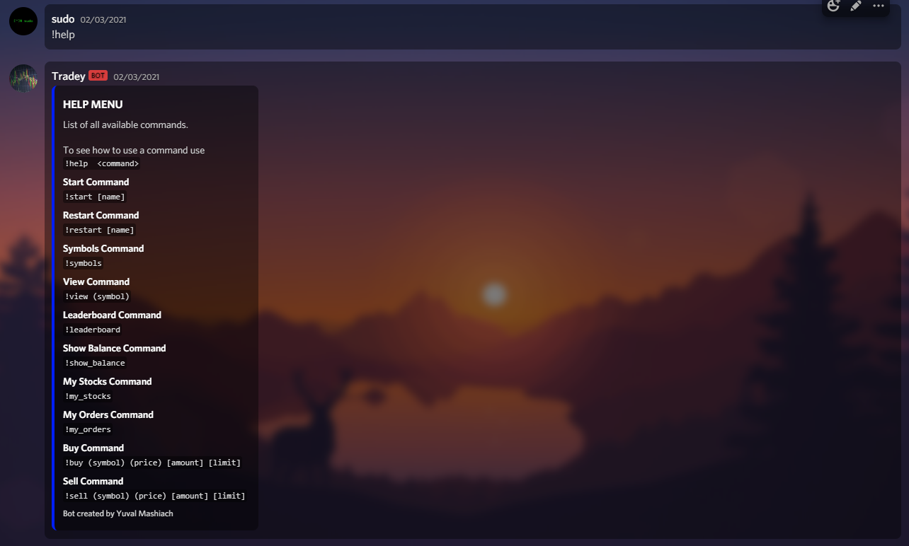
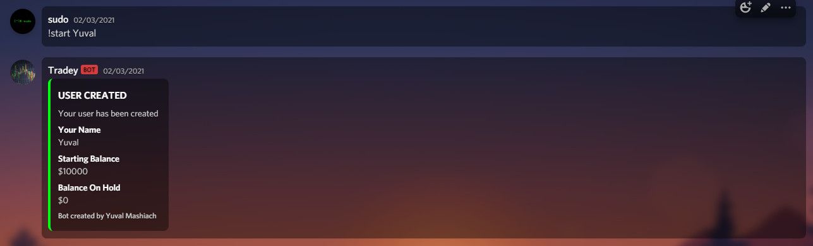
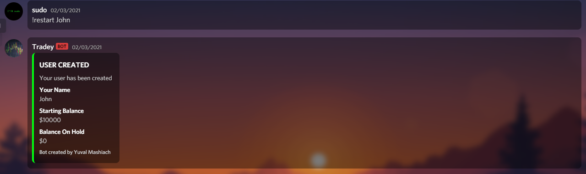
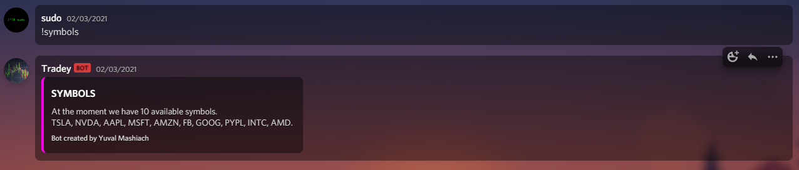
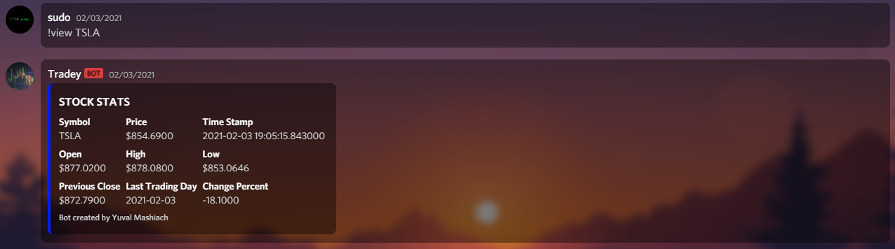
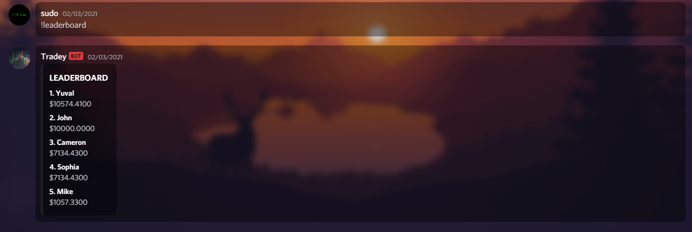
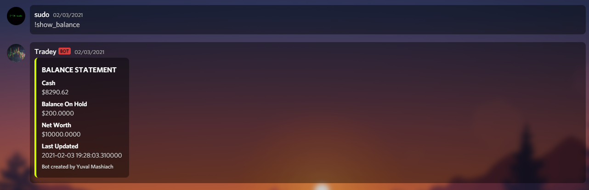
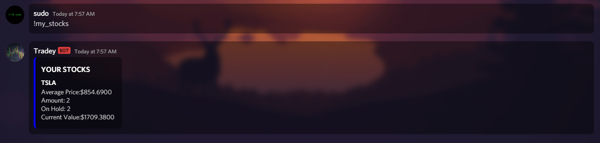
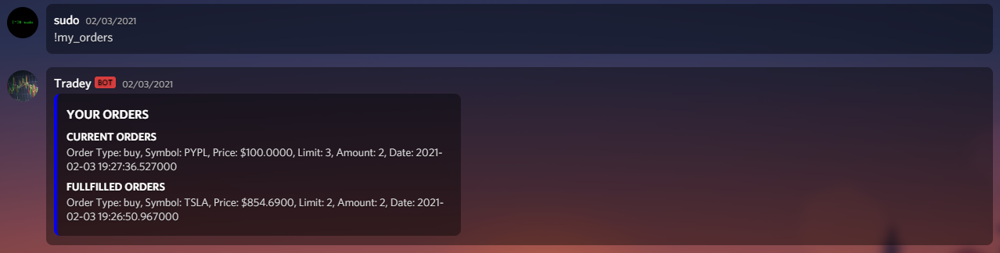
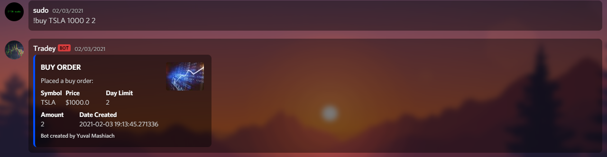
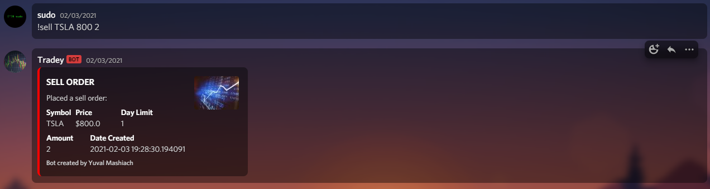